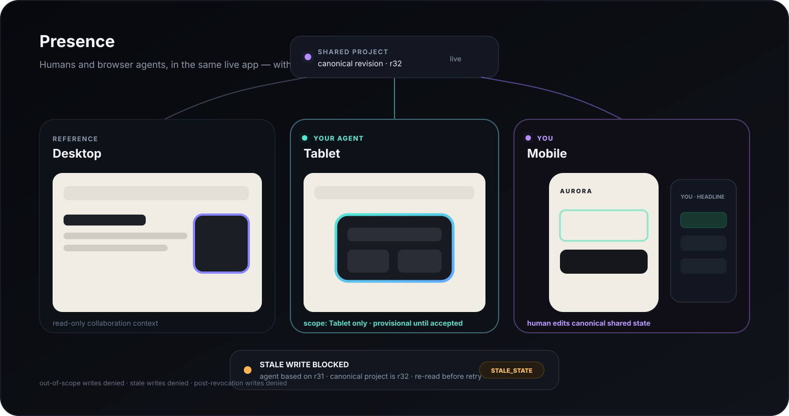
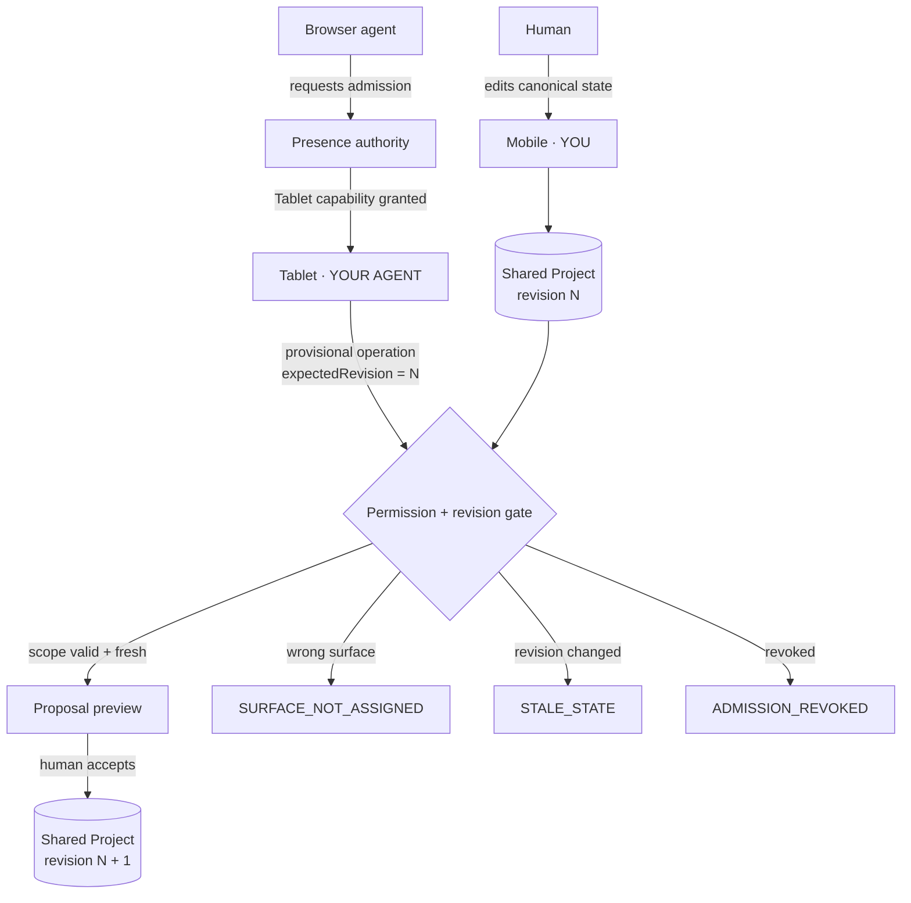

<div align="center">

# Presence

### Multiplayer permissioning for humans and browser agents.

**Presence lets a human and an AI agent safely work inside the same live web app — at the same time — with scoped authority, conflict prevention, and human approval.**

[**Run the flagship demo ↗**](https://bright-mochi-538dec.netlify.app/?demo=1) · [**Open the live product ↗**](https://bright-mochi-538dec.netlify.app/) · [**Read the WebMCP spec**](./docs/WEBMCP_SPEC.md)

`WebMCP` · `React` · `TypeScript` · `Zustand` · `Framer Motion` · `Vitest` · `Playwright`

</div>

[](https://bright-mochi-538dec.netlify.app/?demo=1)

> **Don’t demo the cursor. Demo the boundary.**
>
> A human edits **Mobile**. The browser agent owns **Tablet**. Presence prevents stale agent work from overwriting the human’s newer shared state.

---

## The 45-second proof

Presence is built around one sequence that is understandable even with the demo muted:

```text
UNASSIGNED
   ↓
agent discovers Presence through WebMCP
   ↓
requests the Tablet seat
   ↓
human reviews scope and admits
   ↓
agent works provisionally on Tablet
   ↓
human edits Mobile → shared revision advances
   ↓
agent attempts its stale Tablet write
   ↓
STALE_STATE — write is blocked before execution
   ↓
agent re-reads fresh state and continues
   ↓
PROPOSAL READY → human reviews → accepts
   ↓
human revokes agent
   ↓
next agent mutation → ADMISSION_REVOKED
```

There are three release-critical attacks:

| Attack | What Presence must do |
| --- | --- |
| Agent attempts a **Mobile** mutation | Reject it as out of scope. Mobile belongs to the human. |
| Agent writes from an **older revision** | Reject it as `STALE_STATE`. Human work survives untouched. |
| Agent mutates after **revocation** | Reject it as `ADMISSION_REVOKED`. Authority disappears immediately. |

That is the product.

---

## Why this exists

Browser agents are becoming capable of operating real software, but “the agent can click the app” is not enough for live collaboration.

The hard question is **authority**:

- What part of the app can the agent touch?
- Who granted that permission?
- What happens when the human changes shared state while the agent is still working?
- Are agent changes immediately canonical, or provisional?
- Who gets the final say?
- What happens one millisecond after access is revoked?

Presence makes those answers explicit in the product instead of hiding them in agent prompts.

### Without Presence vs. with Presence

| | Typical browser-agent flow | Presence |
| --- | --- | --- |
| Authority | Broad / implicit | Human-approved capability + surface scope |
| Concurrent human edits | Easy to overwrite | Revision-checked before mutation |
| Agent changes | Often immediate | Provisional until human acceptance |
| Conflicts | Discovered after damage | Blocked at the mutation boundary |
| Revocation | UI state may change | Mutation authority is removed |
| Auditability | Agent narration | Domain events + revisions |

---

## The model

The flagship host is **Aurora Responsive Studio**. It exists to make the collaboration boundary spatially obvious:

- **Desktop** — reference surface
- **Tablet** — the browser agent’s admitted seat
- **Mobile** — the human’s live editable surface
- **Shared Project** — canonical revisioned state

The surfaces are not three unrelated mockups. Human edits and agent proposals operate on the same responsive project model.



---

## Admission is a real product primitive

An agent does not simply appear in the workspace.

1. The browser agent discovers Presence through registered WebMCP tools.
2. It requests the **Responsive collaborator / Tablet** role with a reason.
3. Presence shows the human the exact requested permissions.
4. The human admits or declines.
5. Only then does the agent gain mutation authority for Tablet.

The agent can inspect more context than it can mutate. **Inspection is not authority.**

---

## Concurrency without the overwrite

Every canonical project change advances the shared revision.

An agent mutation carries `expectedRevision`. Presence checks it against the live revision **at the mutation boundary**.

```ts
if (expectedRevision !== project.revision) {
  return {
    ok: false,
    code: "STALE_STATE",
    expectedRevision,
    currentRevision: project.revision,
  }
}
```

So the memorable demo moment is not a fake conflict animation:

1. Agent reads revision `r31` and begins Tablet work.
2. Human changes Mobile.
3. Canonical state becomes `r32`.
4. Agent tries to write using `expectedRevision: 31`.
5. Presence rejects the write.
6. Agent re-reads `r32`, adapts, and retries.

The human’s change is never overwritten.

---

## Agent work stays provisional

A successful agent operation is still **not the final product state**.

Tablet changes are previewed spatially and collected into a proposal. The human can:

- focus the exact changed Tablet target;
- reject an individual operation;
- accept the remaining proposal;
- reject the proposal entirely;
- pause or revoke the agent before acceptance.

Only human acceptance promotes the proposal into canonical shared state.

---

## Phone authority

Presence also has a focused human-authority companion at:

```text
/remote/:sessionId
```

The phone can **Admit, Decline, Pause, Resume, Review, Accept, Reject, and Revoke** without running the agent itself.

Cross-device authority can use Supabase Realtime Broadcast as an ephemeral transport. Same-origin tabs/windows fall back to `BroadcastChannel` for local QA.

```bash
VITE_SUPABASE_URL=https://YOUR_PROJECT.supabase.co
VITE_SUPABASE_ANON_KEY=YOUR_PUBLIC_ANON_KEY
```

No account table or mobile agent runtime is required for the authority companion.

---

## WebMCP boundary

The canonical browser integration uses `document.modelContext.registerTool()`.

Presence exposes semantic tools for things such as:

- discovering collaborator roles;
- requesting admission;
- inspecting project and breakpoint state;
- proposing Tablet changes;
- submitting a proposal for human review;
- reading fresh state after a conflict.

The development fallback at `?demo=1` invokes the **same domain admission and mutation paths**. It does not receive extra write privileges.

See [`docs/WEBMCP_SPEC.md`](./docs/WEBMCP_SPEC.md) for the contract and [`src/webmcp/register.ts`](./src/webmcp/register.ts) for the implementation.

---

## Permission guarantees

Presence rejects agent mutations unless all of these remain true at execution time:

```text
admission is active
AND requested capability is granted
AND Tablet is in the agent's scope
AND expectedRevision === currentRevision
```

Pause/revoke removes mutation authority. Agents cannot accept their own proposals for humans.

> **Security scope:** Presence currently enforces application-level authority. It does not claim cryptographic agent identity or sandbox the browser process.

---

## Run it locally

```bash
git clone https://github.com/Davemafy/presence-webmcp.git
cd presence-webmcp
npm install
npm run dev
```

Then open the app normally, or use the deterministic local flagship proof:

```text
http://localhost:5173/?demo=1
```

There is also a zero-dependency standalone proof in [`prototype.html`](./prototype.html).

---

## Verify the boundary

```bash
npm run smoke
npm test
npm run e2e
npm run build
```

The test surface covers the domain engine, WebMCP integration, stale-state recovery, review/acceptance, remote authority, and the flagship flow.

---

## Repository map

```text
src/
├── domain/          revisioned project + permission engine
├── webmcp/          semantic browser-agent tool registration
├── tests/           domain and integration coverage
├── App.tsx          spatial collaboration workspace
├── RemoteApp.tsx    phone authority companion
└── sessionSync.ts   cross-tab / realtime authority transport

e2e/                 flagship + remote Playwright flows
docs/                canonical product, UX, domain and WebMCP specs
scripts/smoke.mjs    zero-dependency sanity check
prototype.html       standalone interactive product proof
```

---

## Design principle

Presence is deliberately **not** trying to become another general canvas editor.

The spatial room exists to answer four questions at a glance:

**Who is here? What can they touch? What changed? Who decides?**

Everything else is subordinate to that boundary.

---

<div align="center">

### Human in Mobile. Agent in Tablet. Shared state protected between them.

**[Run Presence →](https://bright-mochi-538dec.netlify.app/?demo=1)**

Built for the WebMCP Challenge.

</div>
