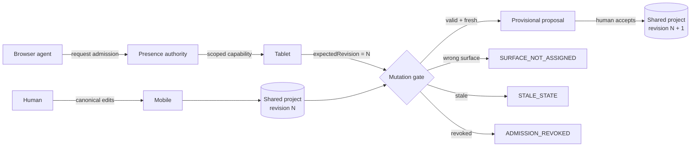

# Presence

**A browser-agent admission layer for live software.**

Presence lets a human and an AI agent work inside the same live web app at the same time — without giving the agent unrestricted control.

The human owns **Mobile**. The browser agent can be admitted into **Tablet**. Both operate on one revisioned project. Agent changes stay provisional, stale writes are rejected before execution, and the human keeps the final say.

[**Run the flagship demo →**](https://bright-mochi-538dec.netlify.app/?demo=1) · [**Open Presence →**](https://bright-mochi-538dec.netlify.app/) · [**WebMCP contract**](./docs/WEBMCP_SPEC.md)

<!-- README HERO VIDEO: place the real Presence demo recording here. Do not replace it with an architecture illustration. -->

> **The demo moment:** while the agent is adapting Tablet, the human edits Mobile. The shared revision advances. The agent's next write is rejected as `STALE_STATE`, it re-reads the project, recovers, and continues — without overwriting the human.

---

## What Presence proves

Presence is built around three attacks that a live human + agent workspace has to survive.

| Attack | Result |
| --- | --- |
| Agent attempts to change **Mobile** | `SURFACE_NOT_ASSIGNED` — Mobile remains human-owned. |
| Human changes shared state while the agent is working | `STALE_STATE` — the old agent write is rejected before execution. |
| Human revokes the agent and it tries another mutation | `ADMISSION_REVOKED` — authority is gone immediately. |

Those results come from the domain engine. They are not scripted error messages for the demo.

---

## The flagship flow

```text
Tablet is empty
    ↓
browser agent discovers Presence through WebMCP
    ↓
agent requests the Tablet collaborator seat
    ↓
human sees the exact requested scope and admits
    ↓
agent inspects the live project and works provisionally on Tablet
    ↓
human edits Mobile → canonical revision advances
    ↓
agent attempts a write from its old revision
    ↓
STALE_STATE
    ↓
agent re-reads fresh state and continues
    ↓
proposal ready
    ↓
human reviews individual Tablet operations
    ↓
human accepts → proposal becomes canonical
    ↓
human revokes agent
    ↓
next mutation → ADMISSION_REVOKED
```

The final state is boring on purpose: one coherent project, no agent left in the workspace, and no human work lost.

---

## Why this exists

A browser agent being able to click a web app is not the same thing as safely collaborating inside it.

Once a human and an agent can both change live software, the important questions become:

- **Admission** — does the agent get to enter at all?
- **Scope** — which surface and capabilities can it mutate?
- **Concurrency** — what happens if the human changes state while the agent is still working?
- **Provisionality** — are agent changes immediately canonical?
- **Authority** — who can accept, pause, or revoke?
- **Evidence** — can the product prove that a denied write was actually denied?

Presence makes those rules part of the application model instead of leaving them in a prompt.

---

## One project, three territories

The demo host is **Aurora Responsive Studio**.

- **Desktop** — reference surface
- **Tablet** — the browser agent's admitted seat
- **Mobile** — the human's editable surface
- **Shared Project** — canonical revisioned state used by both

These are not three disconnected mockups. Human edits and agent proposals operate on the same responsive project model.

The spatial room exists so authority is visible: you can see who occupies a surface, where provisional work is happening, and which project revision everyone is acting against.

---

## Admission before execution

An agent does not simply appear and start editing.

1. A browser agent discovers semantic tools exposed by Presence.
2. It inspects the available collaborator roles.
3. It requests the **Tablet** seat with a reason.
4. The human sees the requested scope.
5. The human admits or declines.
6. Only an active admission creates mutation authority.

Inspection and mutation are intentionally different capabilities. **Seeing the project does not imply permission to change it.**

---

## Revision-gated concurrency

Every canonical human edit advances the shared project revision.

Agent mutation tools must include the revision they inspected:

```ts
expectedRevision: number
```

Presence checks that value again at execution time.

```ts
if (expectedRevision !== project.revision) {
  return {
    ok: false,
    code: "STALE_STATE",
    expectedRevision,
    currentRevision: project.revision,
  }
}
```

So if the agent read `r31`, the human changes Mobile, and the project becomes `r32`, an operation based on `r31` never lands. The agent must re-read `r32` first.

That is the core concurrency guarantee.

---

## Agent work is provisional

A permitted agent mutation still does not become final immediately.

Tablet work is accumulated as a proposal. The human can:

- focus the actual changed Tablet component;
- inspect each operation;
- reject one operation without discarding the rest;
- accept the remaining proposal;
- reject everything;
- pause or revoke the agent before acceptance.

Only human acceptance promotes the proposal into canonical project state.

Agents cannot accept their own proposals on behalf of the human.

---

## WebMCP surface

The canonical browser integration uses `document.modelContext.registerTool()`.

Presence exposes semantic tools for the collaboration lifecycle: role discovery, admission requests, project inspection, breakpoint inspection, scoped Tablet proposals, proposal submission, and fresh-state recovery after conflicts.

The local `?demo=1` path uses the same domain admission and mutation APIs. It does not receive extra write privileges.

See [`src/webmcp/register.ts`](./src/webmcp/register.ts) and [`docs/WEBMCP_SPEC.md`](./docs/WEBMCP_SPEC.md).

---

## Permission boundary

Before an agent mutation executes, Presence requires all of the following:

```text
admission.status === active
capability is granted
requested surface is in scope
expectedRevision === project.revision
```

A failure stops the mutation rather than merely warning after the fact.

Important scope note: this is **application-level authority**. Presence does not claim cryptographic agent identity or browser-process sandboxing.

---

## Human authority can move to a phone

Presence includes a focused authority companion at:

```text
/remote/:sessionId
```

The remote can **Admit, Decline, Pause, Resume, Review, Accept, Reject, and Revoke**. It never runs the agent and does not replace the editor.

Same-origin tabs can synchronize through `BroadcastChannel`. Physical phone ↔ desktop pairing can use an ephemeral Supabase Realtime Broadcast channel:

```bash
VITE_SUPABASE_URL=https://YOUR_PROJECT.supabase.co
VITE_SUPABASE_ANON_KEY=YOUR_PUBLIC_ANON_KEY
```

---

## Architecture



---

## Run locally

```bash
git clone https://github.com/Davemafy/presence-webmcp.git
cd presence-webmcp
npm install
npm run dev
```

Open the normal product at:

```text
http://localhost:5173/
```

Or run the deterministic flagship path:

```text
http://localhost:5173/?demo=1
```

A dependency-free interactive proof also lives in [`prototype.html`](./prototype.html).

---

## Verify it

```bash
npm run smoke
npm test
npm run e2e
npm run build
```

The test surface covers the revisioned domain model, WebMCP integration, stale-state rejection and recovery, proposal review/acceptance, authority revocation, the flagship flow, and the phone authority route.

---

## Repository map

```text
src/
├── domain/          revisioned project + permission engine
├── webmcp/          browser-agent semantic tools
├── tests/           domain + integration tests
├── App.tsx          spatial collaboration workspace
├── RemoteApp.tsx    phone authority companion
└── sessionSync.ts   cross-tab / realtime authority transport

e2e/                 flagship + remote Playwright flows
docs/                product, UX, domain and WebMCP specs
scripts/smoke.mjs    zero-dependency sanity check
prototype.html       standalone interactive proof
```

---

## Design rule

Presence is not trying to become another general canvas editor.

The room exists to make four things obvious without narration:

**Who is here? What can they touch? What changed? Who decides?**

If a feature does not strengthen that boundary, it does not belong in the flagship proof.

---

**Presence — humans and browser agents in the same live software, with authority that stays explicit.**

[**Run the demo →**](https://bright-mochi-538dec.netlify.app/?demo=1)
