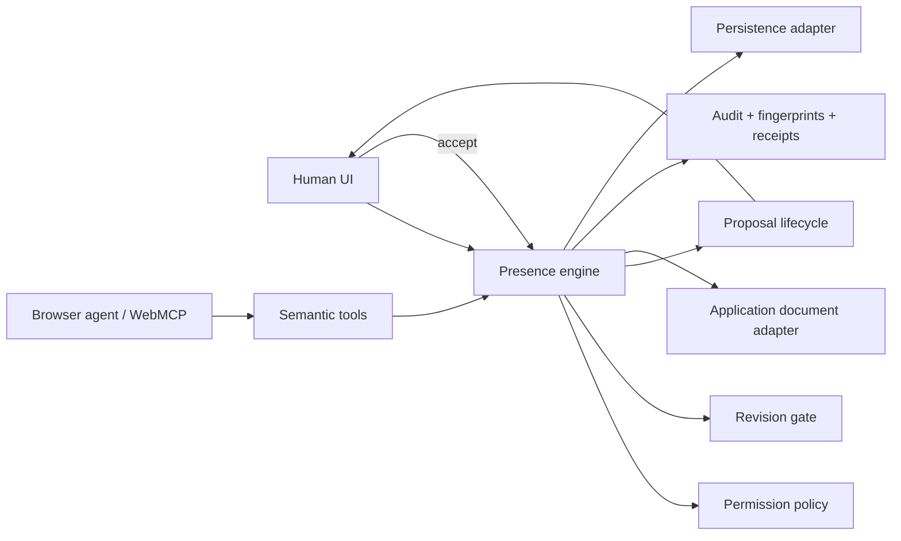

# Architecture

```mermaid
flowchart LR
  H[Human UI] --> E[Presence engine]
  A[Browser agent / WebMCP] --> T[Semantic tools]
  T --> E
  E --> P[Permission policy]
  E --> R[Revision gate]
  E --> Q[Proposal lifecycle]
  Q --> H
  H -->|accept| E
  E --> D[Application document adapter]
  E --> L[Audit + fingerprints + receipts]
  E --> S[Persistence adapter]
```

Aurora and the Launch Control are application adapters. They do not own security policy.
